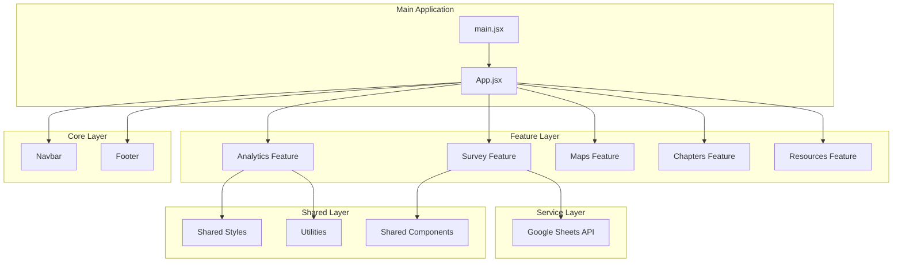
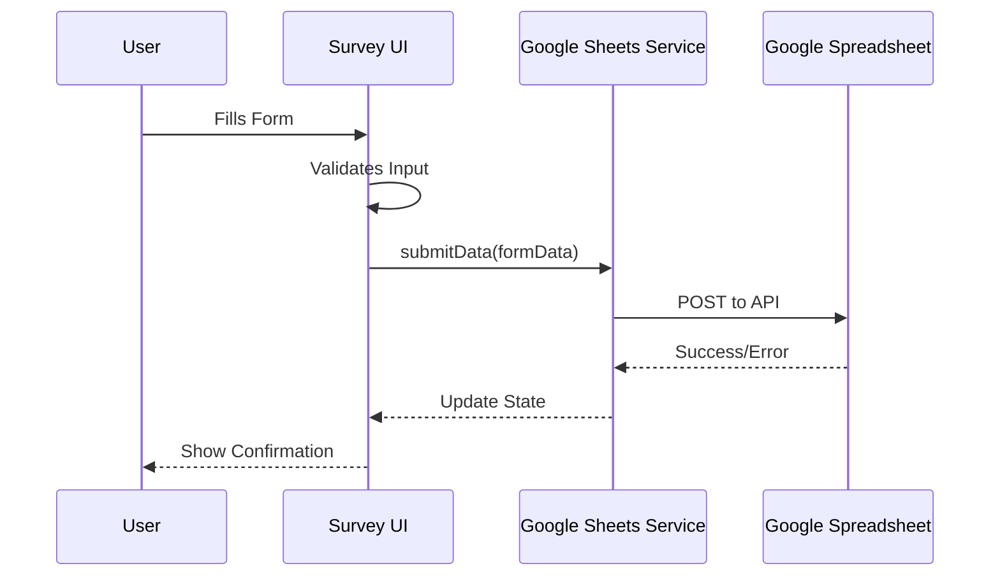

# ACTS Africa Architecture

This document describes the structural organization, module design, and data flow of the ACTS Africa platform.

## 1. Directory Structure

The project follows a feature-based architecture to ensure scalability and maintainability.



### 1.1 Breakdown

```text
src/
├── core/               # Core application configuration and top-level components
│   ├── components/     # Essential UI (Navbar, Footer)
│   └── App.jsx         # Routing and global setup
├── features/           # Domain-specific logic and UI
│   ├── analytics/      # Data visualization and reporting
│   ├── chapters/       # Global expansion management
│   ├── donate/         # Contribution and funding logic
│   ├── feedback/       # Community interaction and feedback
│   ├── maps/           # Interactive geographical data
│   ├── resources/      # Educational materials (Lesson Plans)
│   └── survey/         # Field data collection (Tanzania Survey)
├── pages/              # Route-level entry points
├── services/           # External API communications (Google Sheets)
├── shared/             # Reusable UI, styles, and utilities
└── utils/              # Helper functions
```

## 2. Core Modules

### 2.1 Survey Module (`src/features/survey`)
Handles community data collection. Integrates with **Google Sheets API** for storing responses in real-time.



- **Key Files**: `TanzaniaSurvey.jsx`, `googleSheets.js`

### 2.2 Analytics Module (`src/features/analytics`)
Provides data-driven insights through interactive charts (using `recharts`).
- **Global Analytics**: High-level impact reports.
- **Survey Analytics**: Visual representation of community feedback.
- **Live Data**: Real-time status tracker for regional operations.

### 2.3 Maps Module (`src/features/maps`)
Uses SVG-based interactive maps to visualize outreach in Africa and Tanzania.
- **Interactive Layers**: Regional highlighting and data overlays.

### 2.4 Chapters Module (`src/features/chapters`)
Facilitates the "Save the 2.5B" mission by managing new chapter applications and regional startup guides.

## 3. Data Flow

### 3.1 Field Research Flow
1. **Collector** submits data via `TanzaniaSurvey`.
2. **Service Layer** (`googleSheets.js`) sends data to specific Google Spreadsheet IDs.
3. **Analytics Module** fetches latest records (scheduled or triggered) to update charts.

### 3.2 Global Indicators Flow
1. **Analytics Engine** aggregates data from local chapters.
2. **Dashboard** renders time-series data related to AI literacy and employment trends.

## 4. Design Language

- **Visuals**: Premium dark/warm theme using glassmorphism.
- **Icons**: Material Design Icons (`@mdi/js`).
- **Typography**: Responsive, hierarchy-focused layout.

## 5. Technology Stack

- **Frontend**: React (Vite)
- **Routing**: React Router DOM (v6+)
- **Charts**: Recharts
- **Icons**: Material Design Icons
- **Deployment**: Vercel / Netlify (CI/CD connected to main branch)
