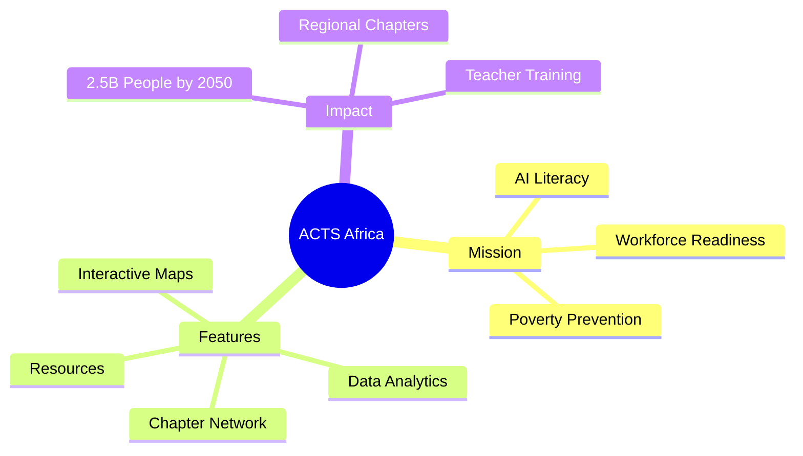

# ACTS Africa - AI for Technology and Society

ACTS Africa is a platform dedicated to informed AI literacy and workforce readiness across Sub-Saharan Africa. Our mission is to educate the 2.5 billion working-class people of 2030-2050 to prevent unemployment and poverty caused by the AI revolution.

## 🚀 Vision
Making sure the youth and workers in Africa are not just consumers of AI, but informed creators and participants in the global digital economy.



## 🏗️ Project Structure
The project follows a **Feature-Based Architecture** for better scalability:

- **`src/core/`**: Critical application setup, routing, and global components (Navbar, Footer).
- **`src/features/`**: Domain-specific modules:
  - `analytics/`: Global impact and survey data visualization.
  - `chapters/`: Management of regional ACTS chapters.
  - `donate/`: Contribution and funding platform.
  - `feedback/`: Community engagement tools (Tell Us).
  - `maps/`: Interactive SVG maps of Africa and Tanzania.
  - `resources/`: Educational materials and AI lesson plans.
  - `survey/`: Field data collection tools.
- **`src/pages/`**: Route-level entry points (Home).
- **`src/shared/`**: Reusable generic components and global styles.

For a detailed breakdown of the technical design, see [ARCHITECTURE.md](./ARCHITECTURE.md).

## 🛠️ Getting Started

### Prerequisites
- Node.js (v16+)
- npm

### Installation
1. Clone the repository
2. Install dependencies:
   ```bash
   npm install
   ```

### Development
Start the development server:
```bash
npm run dev
```

## 📊 Documentation & Strategy
This project is supported by extensive research and strategic planning:

- **[ACTS Africa Survey Analysis & Strategy Document](https://docs.google.com/document/d/1Os-wEg9HM4o2-DORCbpO3hMmBNgrZwxGbdAwEhj4LN4)**
- **[Architecture Overview](./ARCHITECTURE.md)**

## 🛡️ License
MIT License. See [LICENSE](./LICENSE) for details.
